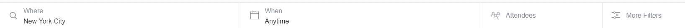

# 2. Identifica los elementos de navegación en los siguientes sites

### Objetivo

Identificar los elementos de navegación en los siguientes sites:

* Breather
* Github
* Medium

## Breather

####**Navegación Global**

####**Navegación Local**

####**Navegación Facetada**

####**Navegación Filtrada**

####**Navegación inline**

## Github

####**Navegación Global**

####**Navegación Local y Facetada**

####**Navegación Filtrada**

## Medium

####**Navegación Global**

####**Navegación Local**

####**Navegación Contextual**

####**Navegación inline**

####**Navegación Facetada**

### **Alumna**

>##### Stephanie Wong Vega

